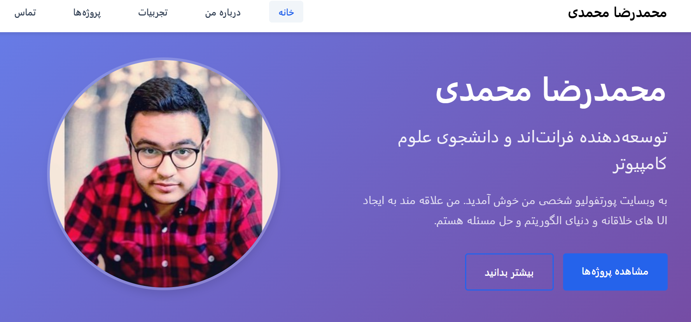

# Mohammadreza Mohammadi - Personal Portfolio



A modern, responsive portfolio website built with pure HTML, CSS, and JavaScript. Features 5 separate pages with smooth navigation and mobile-first design.

## 🚀 Live Demo

Visit the live website: [https://mohamadrezaMH.github.io](https://mohamadrezaMH.github.io)

## 📱 Features

- ✅ **5 Separate Pages**: Home, About, Experience, Projects, Contact
- ✅ **100% Responsive**: Mobile-first design
- ✅ **No Frameworks**: Pure HTML, CSS, JavaScript
- ✅ **Fast Loading**: Optimized performance
- ✅ **SEO Friendly**: Proper meta tags and structure
- ✅ **Accessible**: WCAG guidelines compliance
- ✅ **Cross-browser Compatible**: Works on all modern browsers

## 🛠️ Technologies Used

- **Frontend**: HTML5, CSS3, Vanilla JavaScript
- **Icons**: Font Awesome 6
- **Fonts**: Vazir (Persian), System UI fallback
- **Deployment**: GitHub Pages
- **Version Control**: Git & GitHub

## 📁 Project Structure
```
portfolio/
├── index.html # Home page
├── about.html # About Me page
├── experience.html # Experience page
├── projects.html # Projects page
├── contact.html # Contact page
├── styles/
│ ├── main.css # Shared styles
│ ├── home.css # Home page styles
│ ├── about.css # About page styles
│ ├── experience.css # Experience page styles
│ ├── projects.css # Projects page styles
│ └── contact.css # Contact page styles
├── scripts/
│ ├── navigation.js # Navigation functionality
│ ├── projects.js # Projects filtering
│ ├── contact.js # Contact form validation
│ └── main.js # Shared scripts
├── assets/
│ ├── images/ # All images
│ └── documents/ # PDF files (CV)
└── README.md # Project documentation
```


## 🎯 Pages Overview

### 1. Home (`index.html`)
- Hero section with profile introduction
- Quick links to other pages
- Call-to-action buttons

### 2. About Me (`about.html`)
- Personal introduction and bio
- Technical skills showcase
- Personal interests
- CV download button

### 3. Experience (`experience.html`)
- Timeline of work experience
- Education history
- Certifications and achievements

### 4. Projects (`projects.html`)
- Interactive project gallery
- Filtering by category (Frontend, Backend, Algorithm)
- GitHub links for each project
- Live demo links (where available)

### 5. Contact (`contact.html`)
- Contact information
- Interactive contact form
- Social media links
- Location map

## 🚀 Local Development

### Prerequisites
- Modern web browser
- Code editor (VS Code recommended)
- Git (for version control)

### Installation Steps

1. **Clone the repository:**
```
git clone https://github.com/mohamadrezaMH/mohamadrezaMH.github.io.git
cd mohamadrezaMH.github.io
```
2. **Open in your browser:**
Simply open index.html in your browser or use VS Code Live Server extension
# 📱 Responsive Design

The website uses a mobile-first approach with the following breakpoints:

- **Mobile**: Less than 768px
- **Tablet**: 768px to 1024px  
- **Desktop**: Greater than 1024px

# 🌐 Browser Support

- Chrome (latest versions)
- Firefox (latest versions)
- Safari (latest versions)
- Edge (latest versions)
- Mobile browsers (iOS Safari, Chrome Mobile)

# 🔧 Performance Optimizations

- Minified CSS and JavaScript
- Optimized images and assets
- Efficient loading strategies
- CDN usage for fonts and icons
- Lazy loading for images
- CSS and JavaScript optimization

# 📞 Support

If you encounter any issues or have questions:

- **Email**: [mohamadreza.mh1783@gmail.com](mailto:mohamadreza.mh1783@gmail.com)
- **GitHub Issues**: [Create an issue](https://github.com/mohamadrezaMH/mohamadrezaMH.github.io/issues)
- **LinkedIn**: [Mohammadreza Mohammadi](https://linkedin.com/in/mohammadreza-mohammadi-7377b5277)

# 🤝 Contributing

This is a personal portfolio project. While contributions are welcome, please note that this is tailored to specific personal needs and requirements.

# 📄 License

This project is open source and available under the [MIT License](LICENSE).

# 🚀 Deployment Status

[](https://mohamadrezaMH.github.io)

---

**Developed with ❤️ by Mohammadreza Mohammadi**

- 🎓 Computer Science Student at Amirkabir University
- 💻 Frontend Developer  
- 🚀 Passionate about Web Technologies
